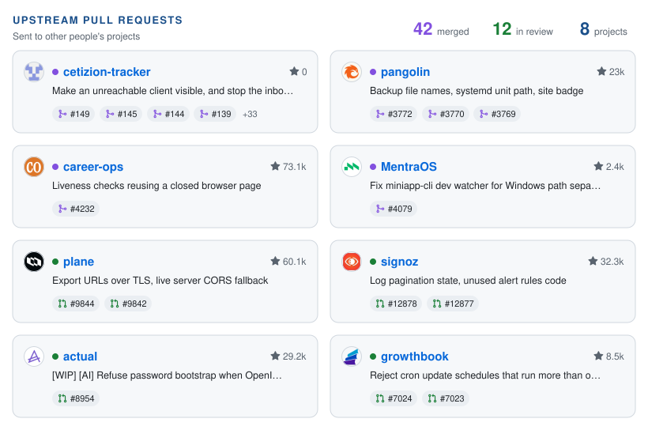

  
  
  
  

  I build production systems and run the infrastructure underneath them. 
  <b>Tech Lead at <a href="https://planetpulse.life">PlanetPulse</a></b>, leading a distributed team of six remotely across Austria and India.

> Most of my recent work lives in private organisation repositories, so this profile shows less than it should. Happy to walk through any of it.

---

## What I'm working on

**🏭 &nbsp;Notch** &nbsp;·&nbsp; a platform manufacturing plants use to report and resolve workplace safety hazards before they cause injuries. Three surfaces, all live in production: a NestJS API, a Next.js console for safety officers, and a React Native app for plant workers. Multi-tenant, with deadline escalation for overdue reports and localisation into 7 languages including right-to-left Arabic.

**🖥️ &nbsp;Infrastructure** &nbsp;·&nbsp; 17 production services across two Linux servers, on Dokploy and Traefik rather than a managed cloud platform. DNS, CDN and email authentication on Cloudflare; offsite backups to Backblaze B2. I also moved the company off paid SaaS subscriptions onto a self-hosted open-source stack covering project management, wiki, password vault, customer support, finance and HR.

**📱 &nbsp;Consulting** &nbsp;·&nbsp; I own a connected-hardware mobile platform end to end for a retained client: roadmap and architecture, hands-on development, code review and releases, the self-hosted infrastructure it runs on, and a typed React Native SDK over the device's Bluetooth Low Energy protocol.

---

<!-- oss:start -->

## Open source

<a href="https://github.com/search?q=is%3Apr+author%3AHayyan612+is%3Apublic+-user%3AHayyan612&type=pullrequests">
  <picture>
    <source media="(prefers-color-scheme: dark)" srcset="assets/oss-dark.svg" />
    <source media="(prefers-color-scheme: light)" srcset="assets/oss-light.svg" />
    
  </picture>
</a>

🟣 merged &nbsp;·&nbsp; 🟢 in review &nbsp;·&nbsp; ★ project stars &nbsp;·&nbsp; refreshed daily

<b>Every pull request</b>

| Status | Project | Pull request | Date |
|---|---|---|---|
| Merged | [embeddedos-org/eOffice](https://github.com/embeddedos-org/eOffice) | [#45](https://github.com/embeddedos-org/eOffice/pull/45) Keep imported note tags from injecting HTML and script | 2026-10-02 |
| Merged | [CetizionVerifica/cetizion-tracker](https://github.com/CetizionVerifica/cetizion-tracker) | [#154](https://github.com/CetizionVerifica/cetizion-tracker/pull/154) The chart style from sales-tracker, on Cetizion's tokens | 2026-09-30 |
| Merged | [CetizionVerifica/cetizion-tracker](https://github.com/CetizionVerifica/cetizion-tracker) | [#153](https://github.com/CetizionVerifica/cetizion-tracker/pull/153) The settings menu crashed the app to a black screen | 2026-09-30 |
| Merged | [CetizionVerifica/cetizion-tracker](https://github.com/CetizionVerifica/cetizion-tracker) | [#152](https://github.com/CetizionVerifica/cetizion-tracker/pull/152) Light mode, and three report charts to match sales-tracker | 2026-09-30 |
| Merged | [CetizionVerifica/cetizion-tracker](https://github.com/CetizionVerifica/cetizion-tracker) | [#149](https://github.com/CetizionVerifica/cetizion-tracker/pull/149) Make an unreachable client visible, and stop the inbox making two of them (gap 2) | 2026-09-30 |
| Merged | [CetizionVerifica/cetizion-tracker](https://github.com/CetizionVerifica/cetizion-tracker) | [#145](https://github.com/CetizionVerifica/cetizion-tracker/pull/145) Type a client contact's email where you actually work (gap 1) | 2026-09-29 |
| Merged | [CetizionVerifica/cetizion-tracker](https://github.com/CetizionVerifica/cetizion-tracker) | [#144](https://github.com/CetizionVerifica/cetizion-tracker/pull/144) Client data gaps and the My Today plan, reviewed and extended | 2026-09-29 |
| Merged | [CetizionVerifica/cetizion-tracker](https://github.com/CetizionVerifica/cetizion-tracker) | [#139](https://github.com/CetizionVerifica/cetizion-tracker/pull/139) One tool for counting, and the two money questions | 2026-09-28 |
| Merged | [CetizionVerifica/cetizion-tracker](https://github.com/CetizionVerifica/cetizion-tracker) | [#138](https://github.com/CetizionVerifica/cetizion-tracker/pull/138) Feed any kind of record in, not just a sales sheet | 2026-09-28 |
| Merged | [CetizionVerifica/cetizion-tracker](https://github.com/CetizionVerifica/cetizion-tracker) | [#140](https://github.com/CetizionVerifica/cetizion-tracker/pull/140) Duplicate companies were pairs, and some of them were wrong | 2026-09-28 |
| Merged | [CetizionVerifica/cetizion-tracker](https://github.com/CetizionVerifica/cetizion-tracker) | [#135](https://github.com/CetizionVerifica/cetizion-tracker/pull/135) Plan and commit a sheet import from a conversation | 2026-09-28 |
| Merged | [CetizionVerifica/cetizion-tracker](https://github.com/CetizionVerifica/cetizion-tracker) | [#136](https://github.com/CetizionVerifica/cetizion-tracker/pull/136) The inbox membership test matched nothing, and tasks went missing | 2026-09-28 |
| Merged | [CetizionVerifica/cetizion-tracker](https://github.com/CetizionVerifica/cetizion-tracker) | [#133](https://github.com/CetizionVerifica/cetizion-tracker/pull/133) MCP tools for the inbox, payables, data gaps and tasks | 2026-09-28 |
| Merged | [CetizionVerifica/cetizion-tracker](https://github.com/CetizionVerifica/cetizion-tracker) | [#132](https://github.com/CetizionVerifica/cetizion-tracker/pull/132) A printable page for people who will never read docs/mcp.md | 2026-09-28 |
| Merged | [CetizionVerifica/cetizion-tracker](https://github.com/CetizionVerifica/cetizion-tracker) | [#131](https://github.com/CetizionVerifica/cetizion-tracker/pull/131) Show what the MCP can do, not just which tools exist | 2026-09-28 |
| Merged | [CetizionVerifica/cetizion-tracker](https://github.com/CetizionVerifica/cetizion-tracker) | [#130](https://github.com/CetizionVerifica/cetizion-tracker/pull/130) Typed output, a page that fits, and a tool that never worked | 2026-09-28 |
| Merged | [CetizionVerifica/cetizion-tracker](https://github.com/CetizionVerifica/cetizion-tracker) | [#127](https://github.com/CetizionVerifica/cetizion-tracker/pull/127) Stop the weekly dependency chore, keep the security net | 2026-09-28 |
| Merged | [CetizionVerifica/cetizion-tracker](https://github.com/CetizionVerifica/cetizion-tracker) | [#126](https://github.com/CetizionVerifica/cetizion-tracker/pull/126) Show the app, with invented clients | 2026-09-28 |
| Merged | [CetizionVerifica/cetizion-tracker](https://github.com/CetizionVerifica/cetizion-tracker) | [#125](https://github.com/CetizionVerifica/cetizion-tracker/pull/125) A README that says what this is now | 2026-09-28 |
| Merged | [CetizionVerifica/cetizion-tracker](https://github.com/CetizionVerifica/cetizion-tracker) | [#124](https://github.com/CetizionVerifica/cetizion-tracker/pull/124) Only providers that keep nothing, and four ways to fall over | 2026-09-28 |
| Merged | [CetizionVerifica/cetizion-tracker](https://github.com/CetizionVerifica/cetizion-tracker) | [#123](https://github.com/CetizionVerifica/cetizion-tracker/pull/123) A re-upload stops reverting what a person corrected | 2026-09-28 |
| Merged | [CetizionVerifica/cetizion-tracker](https://github.com/CetizionVerifica/cetizion-tracker) | [#122](https://github.com/CetizionVerifica/cetizion-tracker/pull/122) A milestone is the project's, and the export is not a second door | 2026-09-28 |
| Merged | [CetizionVerifica/cetizion-tracker](https://github.com/CetizionVerifica/cetizion-tracker) | [#117](https://github.com/CetizionVerifica/cetizion-tracker/pull/117) A failed load no longer says the money is all collected | 2026-09-28 |
| Merged | [CetizionVerifica/cetizion-tracker](https://github.com/CetizionVerifica/cetizion-tracker) | [#113](https://github.com/CetizionVerifica/cetizion-tracker/pull/113) A reply is its own words, with the history one click away | 2026-09-25 |
| Merged | [CetizionVerifica/cetizion-tracker](https://github.com/CetizionVerifica/cetizion-tracker) | [#109](https://github.com/CetizionVerifica/cetizion-tracker/pull/109) The two settings that decide what syncs had no control | 2026-09-25 |
| Merged | [CetizionVerifica/cetizion-tracker](https://github.com/CetizionVerifica/cetizion-tracker) | [#108](https://github.com/CetizionVerifica/cetizion-tracker/pull/108) Re-land the inbox row preview (#107 never reached main) | 2026-09-25 |
| Merged | [CetizionVerifica/cetizion-tracker](https://github.com/CetizionVerifica/cetizion-tracker) | [#107](https://github.com/CetizionVerifica/cetizion-tracker/pull/107) Inbox row: a preview line, and a dot for what nobody has opened | 2026-09-25 |
| Merged | [CetizionVerifica/cetizion-tracker](https://github.com/CetizionVerifica/cetizion-tracker) | [#106](https://github.com/CetizionVerifica/cetizion-tracker/pull/106) The reading pane says which of our addresses the thread came to | 2026-09-25 |
| Merged | [CetizionVerifica/cetizion-tracker](https://github.com/CetizionVerifica/cetizion-tracker) | [#105](https://github.com/CetizionVerifica/cetizion-tracker/pull/105) Opening an email no longer tells the sender you read it | 2026-09-25 |
| Merged | [CetizionVerifica/cetizion-tracker](https://github.com/CetizionVerifica/cetizion-tracker) | [#104](https://github.com/CetizionVerifica/cetizion-tracker/pull/104) An inbox can be deleted, and the delete says what it takes with it | 2026-09-24 |
| Merged | [CetizionVerifica/cetizion-tracker](https://github.com/CetizionVerifica/cetizion-tracker) | [#102](https://github.com/CetizionVerifica/cetizion-tracker/pull/102) The inbox setup screen renders, and has a way in | 2026-09-24 |
| Merged | [CetizionVerifica/cetizion-tracker](https://github.com/CetizionVerifica/cetizion-tracker) | [#99](https://github.com/CetizionVerifica/cetizion-tracker/pull/99) Three things that made a working mailbox look broken | 2026-09-24 |
| Merged | [CetizionVerifica/cetizion-tracker](https://github.com/CetizionVerifica/cetizion-tracker) | [#97](https://github.com/CetizionVerifica/cetizion-tracker/pull/97) The Synced column says whether a sync ran, not just how it would | 2026-09-24 |
| Merged | [CetizionVerifica/cetizion-tracker](https://github.com/CetizionVerifica/cetizion-tracker) | [#96](https://github.com/CetizionVerifica/cetizion-tracker/pull/96) A mailbox that fails to sync says so, instead of looking healthy | 2026-09-24 |
| Merged | [CetizionVerifica/cetizion-tracker](https://github.com/CetizionVerifica/cetizion-tracker) | [#95](https://github.com/CetizionVerifica/cetizion-tracker/pull/95) Motion that was never wired up, and feedback the redirect was eating | 2026-09-24 |
| Merged | [CetizionVerifica/cetizion-tracker](https://github.com/CetizionVerifica/cetizion-tracker) | [#93](https://github.com/CetizionVerifica/cetizion-tracker/pull/93) Tailwind 4 + shadcn foundation (v2 design tokens) | 2026-09-24 |
| Merged | [CetizionVerifica/cetizion-tracker](https://github.com/CetizionVerifica/cetizion-tracker) | [#92](https://github.com/CetizionVerifica/cetizion-tracker/pull/92) TypeScript, one file at a time | 2026-09-22 |
| Merged | [CetizionVerifica/cetizion-tracker](https://github.com/CetizionVerifica/cetizion-tracker) | [#91](https://github.com/CetizionVerifica/cetizion-tracker/pull/91) The shared password guard only applies when shared sign-in is in use | 2026-09-22 |
| Merged | [CetizionVerifica/cetizion-tracker](https://github.com/CetizionVerifica/cetizion-tracker) | [#82](https://github.com/CetizionVerifica/cetizion-tracker/pull/82) Show how an import was planned, not which model read the sheet | 2026-09-20 |
| Merged | [CetizionVerifica/cetizion-tracker](https://github.com/CetizionVerifica/cetizion-tracker) | [#63](https://github.com/CetizionVerifica/cetizion-tracker/pull/63) Ask for a review on every pull request | 2026-09-17 |
| Merged | [Mentra-Community/MentraOS](https://github.com/Mentra-Community/MentraOS) | [#4079](https://github.com/Mentra-Community/MentraOS/pull/4079) Fix miniapp-cli dev watcher for Windows path separators | 2026-09-17 |
| Merged | [career-ops-hq/career-ops](https://github.com/career-ops-hq/career-ops) | [#4232](https://github.com/career-ops-hq/career-ops/pull/4232) Stop reusing the headed page after its browser closes | 2026-09-16 |
| Merged | [fosrl/pangolin](https://github.com/fosrl/pangolin) | [#3772](https://github.com/fosrl/pangolin/pull/3772) Fall back to newtVersion so the Type badge is never empty | 2026-09-16 |
| Merged | [fosrl/pangolin](https://github.com/fosrl/pangolin) | [#3770](https://github.com/fosrl/pangolin/pull/3770) Point the manual systemd unit at the installed CLI path | 2026-09-16 |
| Merged | [fosrl/pangolin](https://github.com/fosrl/pangolin) | [#3769](https://github.com/fosrl/pangolin/pull/3769) Correct month index and zero-pad database backup file names | 2026-09-16 |
| Merged | [CetizionVerifica/cetizion-tracker](https://github.com/CetizionVerifica/cetizion-tracker) | [#16](https://github.com/CetizionVerifica/cetizion-tracker/pull/16) Migrations on deploy, CI checks, and deploys gated on CI | 2026-09-15 |
| In review | [growthbook/growthbook](https://github.com/growthbook/growthbook) | [#7024](https://github.com/growthbook/growthbook/pull/7024) Reject cron update schedules that run more than once an hour | 2026-09-17 |
| In review | [growthbook/growthbook](https://github.com/growthbook/growthbook) | [#7023](https://github.com/growthbook/growthbook/pull/7023) Remove deleted features and experiments from watch lists | 2026-09-17 |
| In review | [Dokploy/website](https://github.com/Dokploy/website) | [#184](https://github.com/Dokploy/website/pull/184) Explain intermittent Bad Gateway for Next.js standalone in Compose | 2026-09-16 |
| In review | [Dokploy/website](https://github.com/Dokploy/website) | [#183](https://github.com/Dokploy/website/pull/183) Target the dokploy container in the auth secret migration script | 2026-09-16 |
| In review | [makeplane/plane](https://github.com/makeplane/plane) | [#9844](https://github.com/makeplane/plane/pull/9844) Drop empty CORS origins so the deny-all fallback is reachable | 2026-09-16 |
| In review | [papra-hq/papra](https://github.com/papra-hq/papra) | [#1522](https://github.com/papra-hq/papra/pull/1522) Declare api key permissions on restore and trash routes | 2026-09-16 |
| In review | [papra-hq/papra](https://github.com/papra-hq/papra) | [#1521](https://github.com/papra-hq/papra/pull/1521) Say what the memory persistence driver costs on restart | 2026-09-16 |
| In review | [SigNoz/signoz](https://github.com/SigNoz/signoz) | [#12878](https://github.com/SigNoz/signoz/pull/12878) Accumulate log pages with a functional state update | 2026-09-16 |
| In review | [SigNoz/signoz](https://github.com/SigNoz/signoz) | [#12877](https://github.com/SigNoz/signoz/pull/12877) Remove unused Manager.Pause method | 2026-09-16 |
| In review | [makeplane/plane](https://github.com/makeplane/plane) | [#9842](https://github.com/makeplane/plane/pull/9842) Honour MINIO_ENDPOINT_SSL when building export presigned URLs | 2026-09-16 |

<!-- oss:end -->

---

## How I run things

<picture>
  <source media="(prefers-color-scheme: dark)" srcset="assets/infra-dark.svg" />
  <source media="(prefers-color-scheme: light)" srcset="assets/infra-light.svg" />
  
</picture>

---

## Featured

<table>
<tr>
<td width="50%" valign="top">

### 🖥️ [dokploy-selfhost-starter](https://github.com/Hayyan612/dokploy-selfhost-starter)

Patterns for running a small company's products and internal tools on your own servers. DNS and email authentication, monorepo Dockerfiles, Compose topologies, backup tooling, and the production pitfalls that are not in the vendor docs.

</td>
<td width="50%" valign="top">

### 💬 [chat-app-microservices](https://github.com/Hayyan612/chat-app-microservices)

Real-time chat as three independent Node.js services behind a Next.js client. Passwordless OTP login queued over RabbitMQ so login never blocks on SMTP, plus Socket.io presence and typing indicators, Redis and MongoDB.

</td>
</tr>
</table>

---

## Stack

**Languages**

**Backend**

**Frontend and Mobile**

**Data**

**Infrastructure**

---

## Contribution activity

<picture>
  <source media="(prefers-color-scheme: dark)" srcset="https://raw.githubusercontent.com/Hayyan612/Hayyan612/output/github-snake-dark.svg" />
  <source media="(prefers-color-scheme: light)" srcset="https://raw.githubusercontent.com/Hayyan612/Hayyan612/output/github-snake.svg" />
  
</picture>
